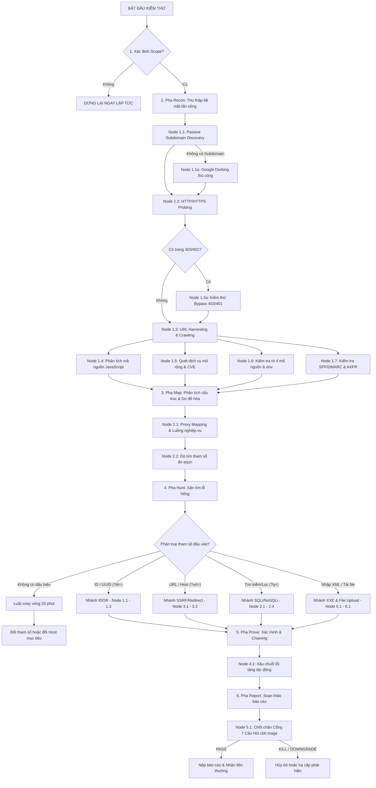

# 01. CẨM NANG QUY TRÌNH KIỂM THỬ VÀ XÁC MINH CHI TIẾT (WORKFLOW & TRIAGE GATE MANUAL)

Tài liệu này cung cấp hướng dẫn vận hành chi tiết cho từng nút quyết định (node) trong chu trình kiểm thử 5 pha, tích hợp các lệnh terminal thực tế, dấu hiệu nhận biết và logic chuyển tiếp trạng thái.

---

## 1. CHI TIẾT TỪNG NÚT QUYẾT ĐỊNH TRONG 5 PHA KIỂM THỬ (DECISION TREE NODES)



### PHA 1: RECON (TRINH SÁT VÀ PHÁT HIỆN BỀ MẶT TẤN CÔNG)

#### 📌 Node 1.1: Thu thập tên miền phụ thụ động (Passive Subdomain Discovery)
*   **Mô tả & Rationale:** Thu thập tất cả các subdomain công khai từ các kho lưu trữ chứng chỉ (Certificate Transparency) và bản ghi lịch sử mà không cần gửi bất kỳ gói tin nào trực tiếp đến máy chủ của mục tiêu. Điều này giúp tránh việc kích hoạt hệ thống phát hiện xâm nhập (IDS/IPS) của mục tiêu ở giai đoạn đầu.
*   **Công cụ & Lệnh thực thi:**
    ```bash
    # Quét thụ động từ các nguồn API miễn phí bằng subfinder
    subfinder -d target.com -silent -o /tmp/subfinder_raw.txt
    
    # Lấy thêm dữ liệu từ assetfinder
    assetfinder --subs-only target.com | anew /tmp/assetfinder_raw.txt
    
    # Gộp và loại bỏ trùng lặp
    cat /tmp/subfinder_raw.txt /tmp/assetfinder_raw.txt | anew /tmp/passive_subdomains.txt
    ```
*   **Kết quả mong đợi:** Một danh sách sạch các subdomain chứa trong tệp `/tmp/passive_subdomains.txt`.
*   **Nhánh quyết định tiếp theo:**
    *   *Nếu số lượng subdomain thu về = 0:* Chuyển sang **Node 1.1a (Google Dorking thủ công)** hoặc quét dải IP ASN.
    *   *Nếu có kết quả:* Chuyển sang **Node 1.2 (HTTP Probing)**.

---

#### 📌 Node 1.1a: Google Dorking thủ công để tìm Subdomain
*   **Mô tả & Rationale:** Khi các công cụ tự động bị chặn hoặc không tìm thấy kết quả, sử dụng các toán tử tìm kiếm nâng cao của Google để tìm các subdomain được lập chỉ mục (index).
*   **Toán tử tìm kiếm:**
    *   `site:*.target.com` (Tìm tất cả subdomain của target.com)
    *   `site:*.target.com -www -mail` (Tìm subdomain nhưng loại trừ trang www và mail để giảm nhiễu)
    *   `site:*.target.com intitle:"login" | intitle:"signin"` (Tìm các trang đăng nhập)
    *   `site:*.target.com filetype:pdf | filetype:xls | filetype:xlsx` (Tìm tài liệu bị lộ)
*   **Quyết định tiếp theo:** Lưu các subdomain tìm được vào `/tmp/passive_subdomains.txt` và chuyển sang **Node 1.2**.

---

#### 📌 Node 1.2: Xác minh hoạt động HTTP/HTTPS (HTTP Probing)
*   **Mô tả & Rationale:** Phân biệt giữa các subdomain chỉ tồn tại trên DNS và các subdomain thực sự đang chạy dịch vụ web (HTTP/HTTPS) để tập trung tài nguyên kiểm thử.
*   **Công cụ & Lệnh thực thi:**
    ```bash
    # Quét xác minh trạng thái HTTP của danh sách subdomain
    # Giải thích tham số:
    #   -status-code: Trích xuất mã phản hồi HTTP (200, 301, 403, 500...)
    #   -title: Lấy tiêu đề trang HTML để biết nội dung sơ bộ
    #   -tech-detect: Phát hiện framework/thư viện đang chạy
    #   -follow-redirects: Chuyển hướng theo mã 301/302 để kiểm tra URL đích
    httpx -l /tmp/passive_subdomains.txt -status-code -title -tech-detect -follow-redirects -silent -o /tmp/live_web_servers.txt
    ```
*   **Kết quả mong đợi:** Danh sách các URL đang hoạt động kèm thông tin công nghệ (Ví dụ: `https://dev.target.com [200] [React] [Nginx]`).
*   **Nhánh quyết định tiếp theo:**
    *   *Phát hiện các host chứa từ khóa nhạy cảm (dev, staging, admin, internal, api, v1, v2):* Chuyển các host này vào danh sách **Ưu tiên 1 (Priority 1 - P1)** để tiến hành quét sâu.
    *   *Phát hiện các host trả về mã lỗi 403 Forbidden hoặc 401 Unauthorized:* Chuyển sang **Node 1.2a (Bypass 403/401)**.
    *   *Các host thông thường:* Chuyển sang **Node 1.3 (URL Harvesting)**.

---

#### 📌 Node 1.2a: Kiểm thử vượt qua bộ lọc 403/401 (Bypass 403/401)
*   **Mô tả & Rationale:** Các cổng quản trị hoặc API nội bộ thường chặn truy cập bằng mã 403. Kiểm thử xem có thể bypass bằng cách thay đổi HTTP Headers hoặc đường dẫn cấu trúc.
*   **Công cụ & Lệnh thực thi (Bypass qua HTTP Header):**
    ```bash
    # Thử giả mạo IP nguồn nội bộ
    curl -H "X-Forwarded-For: 127.0.0.1" -H "X-Forwarded-By: 127.0.0.1" -H "X-Forwarded-Host: localhost" -H "X-Remote-IP: 127.0.0.1" -H "X-Originating-IP: 127.0.0.1" -H "X-Client-IP: 127.0.0.1" -H "Client-IP: 127.0.0.1" -H "True-Client-IP: 127.0.0.1" -H "Cluster-Client-IP: 127.0.0.1" "https://target.com/admin"
    ```
*   **Lệnh thực thi mẫu (Bypass qua Path Traversal / Unicode):**
    ```bash
    # Đọc tài nguyên bị chặn bằng cách dịch chuyển path
    curl "https://target.com/admin/."
    curl "https://target.com/admin/..;/"
    curl "https://target.com/%2e/admin"
    curl -H "X-Original-URL: /admin" "https://target.com/anything"
    curl -H "X-Rewrite-URL: /admin" "https://target.com/anything"
    ```
*   **Quyết định tiếp theo:** Áp dụng **Body-Diff Rule** (Xem mục 2). Nếu nội dung phản hồi thay đổi và lộ dữ liệu nhạy cảm ➔ Xác nhận bypass ➔ Chuyển sang Pha 3. Nếu không ➔ Dừng lại, chuyển sang host khác.

---

#### 📌 Node 1.3: Thu thập liên kết tĩnh và động (URL Harvesting & Crawling)
*   **Mô tả & Rationale:** Thu thập tất cả các đường dẫn URL và tham số để vẽ sơ đồ bề mặt tấn công. Kết hợp tìm kiếm lịch sử (Archive) và bò (Crawl) chủ động.
*   **Công cụ & Lệnh thực thi:**
    ```bash
    # Thu thập URL lịch sử từ Wayback Machine và AlienVault OTX
    gau target.com --subs | anew /tmp/urls_raw.txt
    waybackurls target.com | anew /tmp/urls_raw.txt
    
    # Bò chủ động bằng katana để quét các link sinh ra từ mã JS
    # Tham số: 
    #   -d 3: Độ sâu bò (depth) là 3
    #   -jc: Kích hoạt quét và phân tích file Javascript tĩnh
    #   -kf all: Thu thập tất cả phần mở rộng
    katana -l /tmp/live_web_servers.txt -d 3 -jc -kf all -silent -o /tmp/katana_raw.txt
    
    # Gộp và lọc trùng bằng uro để loại bỏ các URL trùng cấu trúc tham số
    cat /tmp/urls_raw.txt /tmp/katana_raw.txt | uro | anew /tmp/urls_clean.txt
    ```
*   **Kết quả mong đợi:** File `/tmp/urls_clean.txt` chứa danh sách toàn bộ các đường dẫn URL của hệ thống.
*   **Nhánh quyết định tiếp theo:**
    *   *Lọc ra các tệp tin JavaScript (`*.js`):* Chuyển sang **Node 1.4 (JS Audit)**.
    *   *Lọc ra các URL chứa tham số (`?id=`, `?url=`, `?file=`):* Lưu vào `params.txt` và chuyển sang **Pha 3 (Hunt)**.

---

#### 📌 Node 1.4: Phân tích mã nguồn JavaScript (JavaScript Static Analysis)
*   **Mô tả & Rationale:** Phân tích các file JS tĩnh tải về trình duyệt để tìm kiếm endpoint ẩn, thông tin cấu hình và API keys rò rỉ.
*   **Công cụ & Lệnh thực thi:**
    ```bash
    # Lọc danh sách file JS sạch
    cat /tmp/urls_clean.txt | grep "\.js$" | sort -u > /tmp/js_files.txt
    
    # Dùng jsluice trích xuất URL ẩn trong JS
    jsluice urls /tmp/js_files.txt | anew /tmp/js_endpoints.txt
    
    # Quét secrets rò rỉ trong JS bằng trufflehog
    trufflehog filesystem --directory=/tmp/js_downloaded/ --only-verified
    
    # Sử dụng grep nhanh tìm từ khóa nhạy cảm trong JS
    grep -E "(api_key|apikey|secret|password|token|access_key|aws_access)" /tmp/js_files.txt
    ```
*   **Quyết định tiếp theo:** Nếu phát hiện API keys hoạt động hoặc endpoint mới ➔ Cập nhật vào sitemap và chuyển sang **Pha 2 (Map)**.

---

#### 📌 Node 1.5: Quét dịch vụ mở rộng và lỗ hổng đã biết
*   **Mô tả & Rationale:** Quét các cổng dịch vụ phi web và các lỗi CVE đã có mã khai thác công khai.
*   **Công cụ & Lệnh thực thi:**
    ```bash
    # Quét nhanh 1000 cổng TCP mở bằng naabu
    naabu -l /tmp/passive_subdomains.txt -top-ports 1000 -silent -o /tmp/ports_open.txt
    
    # Quét CVEs và cấu hình sai bằng nuclei
    nuclei -l /tmp/live_web_servers.txt -severity critical,high,medium -silent -o /tmp/nuclei_results.txt
    ```
*   **Quyết định tiếp theo:** Nếu phát hiện cổng nhạy cảm (như 6379 - Redis, 27017 - MongoDB) hoặc lỗ hổng CVE ➔ Thực hiện khai thác lập tức và chuyển sang Pha 4.

---

#### 📌 Node 1.6: Kiểm tra rò rỉ mã nguồn và cấu hình (Source Leak & Configuration Quick Wins)
*   **Mô tả & Rationale:** Kiểm tra nhanh các file cấu hình quan trọng bị bỏ quên hoặc file ẩn của hệ thống quản lý phiên bản trước khi tiến hành bò quét sâu. Những file này thường chứa mật khẩu hoặc mã nguồn gốc.
*   **Kịch bản kiểm thử (Bash loop):**
    ```bash
    # Chạy vòng lặp kiểm tra các file nhạy cảm phổ biến
    for PATH in "/.env" "/.env.production" "/.env.local" "/.git/HEAD" \
                "/swagger.json" "/api/swagger.json" "/openapi.json" "/api-docs" \
                "/.git/config" "/package.json" "/composer.json" \
                "/actuator" "/actuator/env" "/actuator/heapdump" \
                "/telescope" "/horizon" "/laravel-filemanager" \
                "/.DS_Store" "/crossdomain.xml" "/clientaccesspolicy.xml"; do
      STATUS=$(curl -s -o /tmp/source_leak_check -w "%{http_code}" --max-time 5 "https://target.com$PATH" 2>/dev/null)
      if [ "$STATUS" = "200" ]; then
        SIZE=$(wc -c < /tmp/source_leak_check)
        echo "[+] PHÁT HIỆN RÒ RỈ ($STATUS - $SIZE bytes): https://target.com$PATH"
      fi
    done
    ```
*   **Kiểm tra Source Map của Next.js/React:**
    1. Tìm file JS chính trên giao diện trang chủ (ví dụ: `main-1a2b3c.js`).
    2. Gửi request tải file `.map` tương ứng: `curl https://target.com/_next/static/chunks/main-1a2b3c.js.map`.
    3. Nếu file tồn tại, dùng công cụ `restore-source-tree` để khôi phục lại mã nguồn gốc.
*   **Quyết định tiếp theo:** Nếu tải được file `.env` hoặc mã nguồn ➔ Xác nhận lỗi Nghiêm trọng (Critical). Trích xuất API keys và chuyển sang Pha 4.

---

#### 📌 Node 1.7: Kiểm tra cấu hình DNS & TLS (DNS & TLS Security Checks)
*   **Mô tả & Rationale:** Rà soát các cấu hình bản ghi DNS lỗi thời có thể dẫn đến việc giả mạo email hoặc chuyển giao vùng DNS tùy tiện.
*   **Các lệnh thực thi:**
    ```bash
    # 1. Kiểm tra bản ghi SPF và DMARC chống giả mạo email
    dig TXT target.com +short | grep "v=spf1"
    dig TXT _dmarc.target.com +short
    
    # 2. Thử nghiệm truyền vùng DNS (Zone Transfer - AXFR)
    for NS in $(dig NS target.com +short); do
      dig AXFR target.com @$NS
    done
    
    # 3. Kiểm tra tiêu đề bảo mật HSTS (Strict-Transport-Security)
    curl -sI "https://target.com/" | grep -i "strict-transport-security"
    ```
*   **Dấu hiệu lỗ hổng:**
    *   Bản ghi SPF chứa tham số `+all` (cho phép bất kỳ IP nào gửi mail mạo danh domain này).
    *   Bản ghi DMARC bị thiếu hoặc có cấu hình `p=none` không bắt buộc lọc mail giả.
    *   Lệnh `AXFR` thành công trả về toàn bộ bản ghi DNS nội bộ.
*   **Quyết định tiếp theo:** Ghi nhận thông tin. Lưu ý: SPF/DMARC/HSTS đơn lẻ thường bị phân loại là lỗi Thấp (Low) hoặc từ chối (N/A) nếu không có kịch bản tấn công đi kèm.

---

### PHA 2: MAP (PHÂN TÍCH CẤU TRÚC VÀ SƠ ĐỒ HÓA ỨNG DỤNG)

#### 📌 Node 2.1: Phân tích luồng nghiệp vụ & Ghi nhận Traffic (Proxy Mapping)
*   **Mô tả & Rationale:** Đi qua toàn bộ quy trình nghiệp vụ của ứng dụng (đăng ký, đăng nhập, thanh toán, đổi điểm thưởng) để hiểu logic xử lý của hệ thống.
*   **Quy trình:**
    1. Bật phần mềm **Burp Suite Proxy**, cấu hình trình duyệt đi qua cổng 127.0.0.1:8080.
    2. Duyệt qua toàn bộ tính năng của trang web với vai trò là người dùng bình thường.
    3. Sắp xếp sơ đồ thư mục (Sitemap) trong Burp Suite theo cấu trúc URL để tìm các endpoint ẩn hoặc các phiên bản API cũ (như `/v1/`, `/v2/`).
*   **Quyết định tiếp theo:** Xác định các khu vực có logic phức tạp (Ví dụ: cổng thanh toán đơn hàng) để chuẩn bị cho Pha 3.

---

#### 📌 Node 2.2: Dò tìm tham số ẩn (Parameter Discovery)
*   **Mô tả & Rationale:** Nhiều API chấp nhận các tham số cấu hình ẩn (như `debug=true`, `admin=true`, `testing=1`) nhưng không hiển thị trên giao diện người dùng. Việc tìm ra các tham số này có thể mở ra hướng tấn công mới.
*   **Công cụ & Lệnh thực thi:**
    ```bash
    # Brute-force tìm tham số GET bằng arjun
    arjun -u https://target.com/api/v1/profile -m GET -oT /tmp/hidden_get_params.txt
    
    # Brute-force tìm tham số POST JSON
    arjun -u https://target.com/api/v1/profile -m POST --json -oT /tmp/hidden_post_params.txt
    ```
*   **Quyết định tiếp theo:** Cập nhật các tham số mới phát hiện vào danh sách kiểm thử của Pha 3.

---

### PHA 3: HUNT (SĂN TÌM LỖ HỔNG)

Mỗi khi tiếp cận một tham số đầu vào, hãy di chuyển theo cây quyết định sau:

```
[THAM SỐ ĐƯỢC XÁC ĐỊNH TRONG PHA 2]
  │
  ├── Tham số dạng số/chuỗi ID (ví dụ: `?id=101`, `/api/invoice/99`)
  │     └── [NHÁNH IDOR]: Chuyển sang Cây quyết định IDOR (Xem 02_web_vulnerabilities.md).
  │
  ├── Tham số nhận địa chỉ URL (ví dụ: `?url=`, `?next=`, `?callback=`)
  │     └── [NHÁNH SSRF / Redirect]: Chuyển sang Cây quyết định SSRF.
  │
  ├── Tham số tìm kiếm, lọc, sắp xếp (ví dụ: `?q=`, `?sort=price`)
  │     └── [NHÁNH SQLi / NoSQLi]: Chuyển sang Cây quyết định SQLi.
  │
  ├── Ứng dụng xử lý dữ liệu XML hoặc tải file (nhập dữ liệu, import)
  │     └── [NHÁNH XXE / File Upload]: Thử tải lên file SVG chứa script hoặc file XML chứa thực thể bên ngoài.
  │
  └── Không thuộc các trường hợp trên
        └── Áp dụng [Luật xoay vòng 20 phút]: Sau 20 phút không có phản hồi bất thường ➔ Đổi tham số khác hoặc đổi host.
```

---

### PHA 4: PROVE (XÁC MINH & CHỨNG MINH TÁC ĐỘNG THỰC TẾ)

#### 📌 Node 4.1: Đánh giá và leo thang tác động (Chaining)
*   **Mô tả & Rationale:** Khi phát hiện một lỗi nhỏ (như Open Redirect), không vội vàng nộp ngay vì mức độ nghiêm trọng thấp. Tìm cách xâu chuỗi nó với các thành phần khác để tăng mức độ tác động.
*   **Ví dụ chuỗi xâu chuỗi (Chains):**
    *   `Open Redirect` + `OAuth Authorize Flow` ➔ `OAuth Token Theft` ➔ **Account Takeover (Critical)**.
    *   `IDOR Read` ➔ Trích xuất UUID của Admin ➔ Đưa UUID vào `IDOR Write` ➔ **Privilege Escalation (High)**.
    *   `CORS Misconfig` + `Sensitive API` ➔ **Cross-Origin Data Theft (High)**.
*   **Quyết định tiếp theo:** Nếu chứng minh được tác động thực tế ➔ Chuyển sang **Pha 5**.

---

### PHA 5: REPORT (SOẠN THẢO BÁO CÁO)

#### 📌 Node 5.1: Chốt chặn Cổng 7 Câu Hỏi (7-Question Gate)
*   **Mô tả:** Chạy công cụ `cbh triage` để tự động hóa việc xác minh tài liệu báo cáo của bạn.
*   **Lệnh thực thi:**
    ```bash
    cbh triage findings/my_new_bug.md
    ```
*   **Nhánh quyết định dựa trên kết quả:**
    *   `PASS` ➔ Chạy `cbh report findings/my_new_bug.md --platform bugcrowd` để xuất bản nháp nộp tiền thưởng.
    *   `KILL` ➔ Hủy bỏ phát hiện này, quay lại Pha 3 để săn tìm lỗi khác.
    *   `DOWNGRADE` ➔ Sửa lại báo cáo, hạ mức độ nghiêm trọng xuống thấp hơn.

---

## 2. CỔNG 7 CÂU HỎI XÁC MINH & QUY TRÌNH 4 CỔNG KIỂM SOÁT CHẤT LƯỢNG

Trước khi tiến hành viết và gửi báo cáo lỗi đến các chương trình Bug Bounty, phát hiện của bạn bắt buộc phải vượt qua hệ thống kiểm soát chất lượng dưới đây nhằm giảm tỷ lệ báo cáo lỗi không hợp lệ (N/A).

### 2.1. Cổng 7 Câu Hỏi (7-Question Gate)

Trả lời **CÓ (YES)** hoặc **KHÔNG (NO)** cho từng câu hỏi sau theo thứ tự. Chỉ cần một câu trả lời **KHÔNG**, dừng ngay việc viết báo cáo và hủy bỏ phát hiện (Kill).

1.  **Q1:** Tôi có thể minh họa lỗi này bằng một request HTTP thực tế **NGAY BÂY GIỜ** không?
    *   *Yêu cầu:* Phải có sẵn request/response thô (raw HTTP) trong tay.
2.  **Q2:** Loại lỗ hổng này có nằm trong danh sách các lỗi được chương trình chấp nhận không?
    *   *Yêu cầu:* Đọc kỹ trang chính sách (Policy) của chương trình mục tiêu.
3.  **Q3:** Tài sản bị lỗi có nằm trong phạm vi được phép kiểm thử (In-Scope) không?
    *   *Yêu cầu:* Kiểm tra chính xác tên miền phụ hoặc dải IP.
4.  **Q4:** Lỗ hổng này có hoạt động mà **KHÔNG** cần quyền quản trị viên cao cấp không?
    *   *Yêu cầu:* Quyền Admin thực hiện hành động Admin không phải là lỗi. Lỗi chỉ được tính khi User thường làm được việc của Admin.
5.  **Q5:** Lỗ hổng này có phải là hành vi chưa từng được công bố hay ghi chép trong tài liệu ứng dụng không?
    *   *Yêu cầu:* Kiểm tra các API công khai của hệ thống để chắc chắn đây không phải là tính năng (feature).
6.  **Q6:** Tôi có thể chứng minh tác động thực tế thay vì chỉ là lỗi lý thuyết không?
    *   *Yêu cầu:* Đọc được dữ liệu nhạy cảm hoặc thực thi hành động trái phép, không chấp nhận báo cáo chỉ có mã phản hồi HTTP 200 trống.
7.  **Q7:** Lỗ hổng này có nằm ngoài danh sách các lỗi "Không bao giờ được nộp" (Never-Submit List) không?
    *   *Yêu cầu:* Loại trừ các lỗi thiếu header bảo mật cơ bản, tự tấn công XSS (Self-XSS), lỗi chuyển hướng đơn thuần không có chuỗi khai thác (Open Redirect alone).

### 2.2. Quy trình 4 Cổng Chất lượng (4-Gate Quality System)

*   **Cổng 0: Kiểm chứng kỹ thuật (30 giây)**
    *   Xác minh lỗi chạy được trên môi trường thực tế, không dựa vào mã giả hay suy đoán lý thuyết.
*   **Cổng 1: Đánh giá Tác động thực tế (2 phút)**
    *   Trả lời rõ ràng câu hỏi: "Kẻ tấn công sẽ lấy đi được cái gì hoặc làm thay đổi được gì trong hệ thống sau khi khai thác thành công?"
*   **Cổng 2: Kiểm tra Trùng lặp (5 phút)**
    *   Tìm kiếm trên HackerOne Hacktivity, các báo cáo cũ và Github Issues để đảm bảo lỗi chưa từng được báo cáo trước đây.
*   **Cổng 3: Chất lượng Báo cáo (10 phút)**
    *   Tiêu đề báo cáo theo công thức chuẩn: `[Tên lỗ hổng] tại [Endpoint] cho phép [Vai trò attacker] thực hiện [Tác động]`. Các bước tái dựng phải có HTTP Request thô.

---

## 3. QUY TẮC KIỂM TRA CHÉO (CROSS-CHECKING RULES)

Để loại bỏ hoàn toàn lỗi False Positive (lỗi giả), bạn phải áp dụng 4 quy tắc kiểm tra chéo sau:

### Quy tắc 1: Kiểm thử Mẫu Thống Kê (Statistical-Sample Rule)
*   **Áp dụng:** Đối với các lỗ hổng dựa trên thời gian phản hồi (Time-based Blind SQLi, Blind SSRF).
*   **Cách thực hiện:** Không bao giờ kết luận lỗi chỉ sau 1 request phản hồi chậm. Gửi liên tiếp **10 request đan xen** giữa request bình thường và request chứa payload.
*   **Ví dụ:**
    *   Request 1 (Normal) ➔ Phản hồi: 120ms
    *   Request 2 (Payload Sleep 5s) ➔ Phản hồi: 5120ms
    *   Request 3 (Normal) ➔ Phản hồi: 125ms
    *   Request 4 (Payload Sleep 5s) ➔ Phản hồi: 5090ms
    *   Nếu thời gian phản hồi của các request chứa payload luôn trễ đúng khoảng thời gian ngủ, lỗi được xác nhận.

### Quy tắc 2: So sánh Khác biệt Phản hồi (Body-Diff Rule)
*   **Áp dụng:** Đối với lỗi bỏ qua bộ lọc (Bypass 403) và dò tìm tham số.
*   **Cách thực hiện:** So sánh từng byte dữ liệu phản hồi của request baseline (chuẩn) và request thử nghiệm.
*   **Yêu cầu:** Sự khác biệt phải nằm ở phần dữ liệu thực tế (chứa PII, token, hoặc cấu trúc HTML mới), không tính sự thay đổi của thời gian (timestamp) hay các chuỗi ID phiên ngẫu nhiên trong response body.

### Quy tắc 3: Kỷ luật Đánh dấu Ký tự (Marker Discipline Rule)
*   **Áp dụng:** Đối với lỗi chèn mã độc (XSS, SQLi, LFI).
*   **Cách thực hiện:** Sử dụng một chuỗi ký tự ngẫu nhiên duy nhất (Marker) không trùng lặp (ví dụ: `cpmark987abc`) làm giá trị đầu vào. Chỉ xác nhận lỗ hổng khi chuỗi ký tự này được phản chiếu nguyên vẹn trong HTML phản hồi hoặc xuất hiện trong thông báo lỗi của Cơ sở dữ liệu.

### Quy tắc 4: Cấm Vòng Lặp Vô Hạn (Shell-Loop Ban)
*   **Áp dụng:** Khi viết công cụ hoặc chạy lệnh tự động quét.
*   **Cách thực hiện:** Nghiêm cấm sử dụng các vòng lặp vô hạn hoặc các lệnh quét song song quá tải. Giới hạn số lượng luồng quét tối đa là **5 tiến trình song song** và thời gian giãn cách giữa các request tối thiểu là **100ms** để không gây nghẽn mạng hoặc kích hoạt WAF.

---

## 4. HƯỚNG DẪN VẬN HÀNH CÔNG CỤ DÒNG LỆNH `cbh` CLI

Bộ công cụ `cbh` (Claude-BugHunter CLI) là bộ lệnh điều khiển chính để tự động hóa quy trình kiểm thử trong dự án này.

### Lệnh 1: `/recon` - Quét trinh sát bề mặt tấn công
*   **Mô tả:** Chạy toàn bộ chu trình thu thập subdomain, dò cổng dịch vụ và quét IP.
*   **Cú pháp:**
    ```bash
    cbh recon target.com
    ```
*   **Ví dụ nâng cao:**
    ```bash
    # Quét nhanh bỏ qua việc tìm kiếm URLs lịch sử
    cbh recon target.com --fast
    ```

### Lệnh 2: `/surface` - Lọc và hiển thị bề mặt tấn công
*   **Mô tả:** Phân loại các URL thu hoạch được theo các nhóm lỗ hổng mục tiêu.
*   **Cú pháp:**
    ```bash
    cbh surface target.com
    ```

### Lệnh 3: `/intel` - Phân tích sâu thông tin DNS/TLS
*   **Mô tả:** Kiểm tra các cấu hình lỗi SPF, DMARC, DNS Zone Transfer và chứng chỉ TLS.
*   **Cú pháp:**
    ```bash
    cbh intel target.com
    ```

### Lệnh 4: `/hunt` - Săn tìm lỗ hổng tự động
*   **Mô tả:** Chạy các mẫu quét lỗ hổng theo danh sách tham số đầu vào được phát hiện.
*   **Cú pháp:**
    ```bash
    cbh hunt target.com --bug-class sqli,ssrf
    ```

### Lệnh 5: `/validate` - Xác minh lỗ hổng sâu
*   **Mô tả:** Chạy quy trình kiểm tra chéo (4 Gates) để xác nhận lỗ hổng trước khi báo cáo.
*   **Cú pháp:**
    ```bash
    cbh validate findings/my_finding.json
    ```

### Lệnh 6: `/triage` - Đánh giá nhanh go/no-go
*   **Mô tả:** Chạy Cổng 7 Câu Hỏi nhanh cho một tệp tin mô tả lỗi.
*   **Cú pháp:**
    ```bash
    cbh triage findings/my_new_bug.md
    ```

### Lệnh 7: `/remember` - Ghi nhớ kết quả kiểm thử vào bộ nhớ đệm
*   **Mô tả:** Lưu trạng thái, session cookie hoặc cấu hình mục tiêu vào DB nội bộ.
*   **Cú pháp:**
    ```bash
    cbh remember --target target.com --cookie "session=abc123xyz"
    ```

### Lệnh 8: `/report` - Tự động tạo báo cáo lỗi theo mẫu
*   **Mô tả:** Chuyển đổi tệp tin kết quả xác minh thành báo cáo markdown hoàn chỉnh theo tiêu chuẩn HackerOne hoặc Bugcrowd.
*   **Cú pháp:**
    ```bash
    cbh report findings/my_new_bug.md --platform hackerone --output reports/h1_report.md
    ```

### Lệnh 9: `/chain` - Xâu chuỗi các lỗ hổng phát hiện
*   **Mô tả:** Liên kết các phát hiện đơn lẻ thành một chuỗi khai thác phức tạp hơn.
*   **Cú pháp:**
    ```bash
    cbh chain findings/bug_redirect.json findings/bug_oauth.json --output findings/chain_ato.json
    ```

### Lệnh 10: `/autopilot` - Vận hành kiểm thử hoàn toàn tự động
*   **Mô tả:** Chạy tự động chuỗi lệnh từ Recon ➔ Map ➔ Hunt ➔ Triage không cần tương tác của người dùng.
*   **Cú pháp:**
    ```bash
    cbh autopilot target.com
    ```
