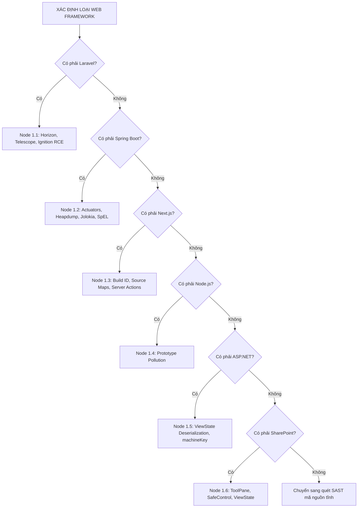

# 03. BẢO MẬT WEB FRAMEWORK VÀ QUÉT MÃ NGUỒN TĨNH CHI TIẾT (SAST MANUAL)

Tài liệu này cung cấp hướng dẫn kỹ thuật chi tiết cho từng nút quyết định (node) khi đánh giá cấu hình sai của các Web Framework phổ biến và các lệnh `grep` nâng cao dùng cho kiểm thử hộp trắng (White-box SAST).

---

## 1. CÂY QUYẾT ĐỊNH ĐÁNH GIÁ WEB FRAMEWORK CẤU HÌNH SAI



### 📌 Node 1.1: Đánh giá bảo mật Laravel (Horizon, Telescope, Debug Mode)
*   **Mô tả & Rationale:** Laravel cấu hình sai thường liên quan đến chế độ gỡ lỗi `APP_DEBUG=true` hiển thị thông tin nhạy cảm của tệp `.env` hoặc các trang quản trị không cài đặt middleware phân quyền.
*   **Quy trình kiểm thử & Khai thác:**
    1.  **Kiểm tra Debug Mode:** Truy cập đường dẫn không tồn tại (Ví dụ: `https://target.com/nonexistent_test_path`). Nếu hiển thị giao diện báo lỗi Ignition chi tiết ➔ [XÁC NHẬN APP_DEBUG HOẠT ĐỘNG]. Sao chép `APP_KEY` và thông tin cấu hình nhạy cảm.
    2.  **Khai thác Ignition RCE (Ignition <= 2.5.1 - CVE-2021-3129):** Sử dụng công cụ `laravel-ignition-rce` để gửi chuỗi deserialization thông qua file log `.log` của Laravel, chuyển đổi log thành tệp tin php thực thi lệnh.
    3.  **Kiểm tra Endpoint quản trị mặc định:**
        *   `https://target.com/horizon` (Dashboard quản trị hàng đợi)
        *   `https://target.com/telescope` (Dashboard giám sát log)
        *   `https://target.com/storage/logs/laravel.log` (Rò rỉ tệp log mặc định)
        *   Nếu truy cập trực tiếp không cần đăng nhập ➔ Xác nhận lỗi phân quyền.
*   **Mã nguồn vá lỗi (Laravel `config/app.php` & `.env`):**
    ```env
    # Tắt chế độ debug trên môi trường production
    APP_DEBUG=false
    # Đổi khóa ứng dụng định kỳ
    APP_KEY=base64:uqN2H...
    ```

---

### 📌 Node 1.2: Đánh giá Actuator Endpoints trên Spring Boot (Java)
*   **Mô tả & Rationale:** Spring Boot Actuator cung cấp các endpoint giám sát hoạt động của máy chủ. Cấu hình sai cho phép người dùng ngoài truy cập không cần xác thực các thông tin nhạy cảm.
*   **Quy trình kiểm thử & Khai thác:**
    1.  **Kiểm tra danh sách Endpoints:**
        *   `https://target.com/actuator/env` (Xem biến môi trường - Tìm `password`, `key`)
        *   `https://target.com/actuator/heapdump` (Tải RAM dump - Tìm secrets)
        *   `https://target.com/actuator/jolokia` (Thực thi JMX - RCE thông qua nạp cấu hình logback)
        *   `https://target.com/actuator/gateway` (Spring Cloud Gateway SSRF/RCE)
    2.  **Khai thác Heap Dump để tìm mật khẩu:**
        ```bash
        # Tải file heapdump về máy
        curl -o heapdump.hprof "https://target.com/actuator/heapdump"
        # Sử dụng tool jep hoặc Eclipse MAT để tìm các đối tượng chứa mật khẩu cleartext
        strings heapdump.hprof | grep -E "password|secret|token" | head -100
        ```
    3.  **Khai thác SpEL (Spring Expression Language) Injection:** Nếu tham số trong ứng dụng được xử lý bằng SpEL (Ví dụ qua các biểu thức `#{...}`), tiêm payload chạy lệnh:
        `#{T(java.lang.Runtime).getRuntime().exec('id')}`

---

### 📌 Node 1.3: Đánh giá bảo mật Next.js (Next.js Auditing)
*   **Mô tả & Rationale:** Ứng dụng Next.js thường để lộ các bản đồ mã nguồn (Source Maps) và cấu hình Server Actions không phân quyền.
*   **Quy trình kiểm thử:**
    1.  **Kiểm tra Next.js Build ID & Manifest:**
        *   Truy cập: `https://target.com/_next/static/[BUILD_ID]/_buildManifest.js` để tìm sơ đồ các file JS tĩnh.
    2.  **Kiểm tra Source Map:**
        *   Tìm các URL file JS (Ví dụ: `https://target.com/_next/static/chunks/main.js`).
        *   Thử tải file `.map` tương ứng: `https://target.com/_next/static/chunks/main.js.map`.
        *   Nếu tải được ➔ Dùng `restore-source-tree` để khôi phục mã nguồn gốc.
    3.  **Đánh giá Server Actions (Next.js >= 13):**
        *   Các hàm Server Actions có thể bị gọi trực tiếp qua HTTP POST request (với header `Next-Action`). Xác minh xem các API Server Actions này có kiểm tra phân quyền người dùng ở phía Server hay chỉ kiểm tra ở phía Client.

---

### 📌 Node 1.4: Kiểm thử Node.js Prototype Pollution
*   **Mô tả & Rationale:** Prototype Pollution cho phép ghi đè các thuộc tính của lớp đối tượng gốc `Object.prototype` thông qua các hàm merge/clone không an toàn.
*   **Kịch bản kiểm thử (JSON POST):**
    ```json
    {
      "__proto__": {
        "polluted_property": "is_polluted"
      }
    }
    ```
*   **Leo thang RCE (chạy lệnh hệ thống):** Tìm cách đầu độc tùy chọn khởi tạo của tiến trình con thông qua ghi đè thuộc tính `shell` hoặc `NODE_OPTIONS` trong module `child_process`.
*   **Vá lỗi (Node.js):** Sử dụng `Object.create(null)` để tạo đối tượng không có prototype hoặc dùng thư viện an toàn như lodash bản mới nhất.

---

### 📌 Node 1.5: Đánh giá bảo mật ASP.NET (ViewState & machineKey)
*   **Mô tả & Rationale:** Lỗi giải tuần tự hóa ViewState không an toàn trên các trang Webforms khi khóa `machineKey` bị rò rỉ hoặc ViewState không bật cơ chế xác thực MAC.
*   **Quy trình kiểm thử:**
    1.  Kiểm tra thuộc tính `__VIEWSTATE` trong HTML. Nếu thuộc tính `__VIEWSTATEENCRYPTED` trống (không có giá trị), ViewState đang ở chế độ ký (signed-only), không được mã hóa.
    2.  Nếu tìm thấy khóa `validationKey` (Ví dụ từ file `web.config` rò rỉ):
        ```bash
        # Sử dụng ysoserial.net để tạo Payload ViewState độc hại chạy lệnh
        ysoserial.exe -g TypeConfuseDelegate -c "calc.exe" --generator="GENERATOR_HEX" --validkey="VALIDATION_KEY_HEX" --validalg="SHA1"
        ```

---

### 📌 Node 1.6: Đánh giá bảo mật SharePoint Server Configuration
*   **Mô tả & Rationale:** SharePoint Server được xây dựng trên nền tảng ASP.NET. Các trang cấu hình mặc định (như ToolPane.aspx) nếu mở công khai kết hợp với ViewState không mã hóa sẽ dẫn đến leo thang đặc quyền hoặc RCE (Ví dụ: CVE-2025-53770).
*   **Đường dẫn kiểm thử:**
    *   `https://target.com/_layouts/15/ToolPane.aspx?DisplayMode=Edit` (Giao diện chỉnh sửa công cụ)
    *   `https://target.com/_api/contextinfo` (Lấy token FormDigest của SharePoint)
*   **Cách kiểm thử SafeControl Enumeration:** Gửi request đến `Picker.aspx?PickerDialogType=Microsoft.SharePoint.WebControls.[TypeName]` để xác minh xem class đó có tồn tại trong cấu hình SafeControl hay không dựa trên mã phản hồi HTTP hoặc thông điệp lỗi.

---

## 2. CHUYÊN SÂU LỆNH `grep` KIỂM THỬ HỘP TRẮNG (SAST) CHO 6 NGÔN NGỮ

Các lệnh dưới đây sử dụng `grep` để quét đệ quy mã nguồn tĩnh, hiển thị số dòng (`-n`), bỏ qua tệp nhị phân (`-I`), hỗ trợ lọc đuôi file cụ thể.

### 2.1. Ngôn ngữ JavaScript / TypeScript (Node.js)
```bash
# 1. Tìm các hàm thực thi lệnh hệ thống trực tiếp (Nguy cơ Command Injection)
grep -rnI "child_process\.exec\|child_process\.spawn\|execSync(" --include="*.js" --include="*.ts"

# 2. Tìm các hàm ghi HTML thô vào DOM không lọc (Nguy cơ DOM XSS)
grep -rnI "innerHTML\|outerHTML\|document.write(\|dangerouslySetInnerHTML" --include="*.js" --include="*.ts"

# 3. Lắng nghe sự kiện message thiếu kiểm tra Origin gửi (Nguy cơ PostMessage Hijacking)
grep -rnI "addEventListener.*message" --include="*.js" --include="*.ts"

# 4. Tìm hàm giải mã JWT không kiểm tra chữ ký (alg: none)
grep -rnI "jwt\.verify(.*verifyOptions\|jwt\.decode(" --include="*.js" --include="*.ts"

# 5. Các hàm merge/extend đối tượng dễ bị Prototype Pollution
grep -rnI "merge(\|extend(\|clone(" --include="*.js" --include="*.ts"
```

### 2.2. Ngôn ngữ Python
```bash
# 1. Tìm hàm giải tuần tự hóa dữ liệu không an toàn (Deserialization RCE)
grep -rnI "pickle\.loads\|yaml\.load(\|marshal\.loads\|shelve\.open" --include="*.py"

# 2. Tìm các hàm chạy lệnh shell hệ thống
grep -rnI "subprocess\.Popen\|subprocess\.run\|os\.system\|os\.popen\|subprocess\.call" --include="*.py"

# 3. Tìm hàm thực thi chuỗi code động
grep -rnI "eval(\|exec(" --include="*.py"

# 4. Tìm lỗ hổng Path Traversal khi mở file
grep -rnI "open(.*file\|open(.*filename" --include="*.py"
```

### 2.3. Ngôn ngữ PHP
```bash
# 1. Tìm hàm giải tuần tự hóa đối tượng (PHP Object Injection)
grep -rnI "unserialize(" --include="*.php"

# 2. Tìm hàm chạy mã nguồn động (RCE sinks)
grep -rnI "eval(\|preg_replace.*\/e\|assert(" --include="*.php"

# 3. Tìm các hàm thực thi lệnh shell trực tiếp
grep -rnI "system(\|exec(\|shell_exec(\|passthru(\|popen(\|proc_open" --include="*.php"

# 4. So sánh lỏng lẻo dễ bypass logic xác thực (Type Juggling)
grep -rnI "==.*password\|==.*token\|==.*hash" --include="*.php"

# 5. Hàm include/require động nhận tham số từ client (LFI/RFI)
grep -rnI "include(\|require(\|include_once(\|require_once(" --include="*.php" | grep "\$"
```

### 2.4. Ngôn ngữ Go (Golang)
```bash
# 1. Tìm hàm chèn HTML trực tiếp không qua lọc mã độc (XSS sinks)
grep -rnI "template\.HTML(\|template\.JS(\|template\.URL(" --include="*.go"

# 2. Tìm các hàm SQLi (Nối chuỗi trực tiếp gửi đến Database)
grep -rnI "db\.Query(\".*\+\|db\.Exec(\".*\+" --include="*.go"

# 3. Tìm hàm thực thi lệnh hệ thống nhận biến trực tiếp
grep -rnI "exec\.Command(" --include="*.go" | grep "\+"
```

### 2.5. Ngôn ngữ Ruby
```bash
# 1. Tìm hàm giải tuần tự hóa và biên dịch mã động
grep -rnI "YAML\.load[^_]\|Marshal\.load\|eval(" --include="*.rb"

# 2. Tìm thuộc tính cho phép gán hàng loạt (Mass Assignment)
grep -rnI "attr_accessible\|permit(" --include="*.rb"

# 3. Tìm hàm thực thi lệnh hệ thống trực tiếp
grep -rnI "system(\|exec(\|%\x\|io\.popen" --include="*.rb"
```

### 2.6. Ngôn ngữ Rust
```bash
# 1. Tìm các hàm dễ gây sập chương trình (Panic DoS) do không xử lý ngoại lệ đầu vào
grep -rnI "\.unwrap()\|\.expect(" --include="*.rs"

# 2. Tìm khối lệnh unsafe (Bỏ qua trình kiểm tra an toàn bộ nhớ của Rust compiler)
grep -rnI "unsafe {" --include="*.rs" -B5

# 3. Tìm các hàm thực thi lệnh shell hệ thống
grep -rnI "Command::new(" --include="*.rs"
```

---

## 3. PHƯƠNG PHÁP PHÂN TÍCH TAINT ANALYSIS (TRUY VẾT DỮ LIỆU)

Khi quét SAST phát hiện một hàm nguy hiểm (Sink):

1.  **Xác định Điểm Cuối (Sink):** Ví dụ dòng code chứa `execSync(userInput)`.
2.  **Truy vết ngược dòng (Trace Back):** Tìm nơi biến `userInput` được gán giá trị.
3.  **Xác định Điểm Đầu (Source):** Kiểm tra xem biến đó có nhận dữ liệu trực tiếp từ các tham số request của người dùng (như `req.query.cmd` hoặc `req.body.param`) hay không.
4.  **Kiểm tra bộ lọc (Sanitization):** Xem trên đường đi từ Source ➔ Sink có hàm kiểm tra hoặc lọc ký tự đặc biệt nào không. Nếu không có bộ lọc ➔ **Xác nhận lỗ hổng tồn tại**.
